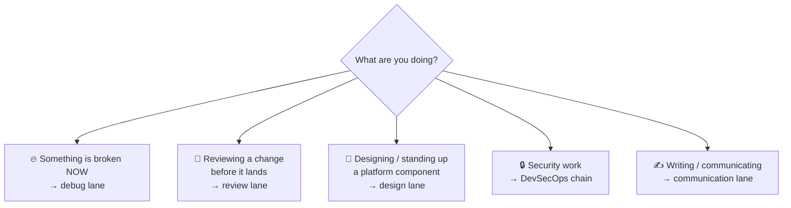
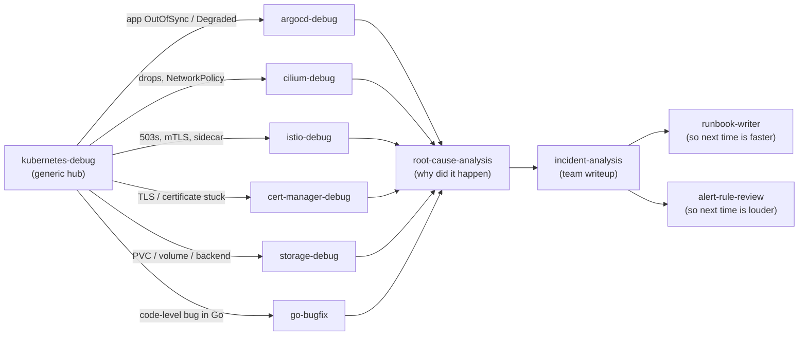
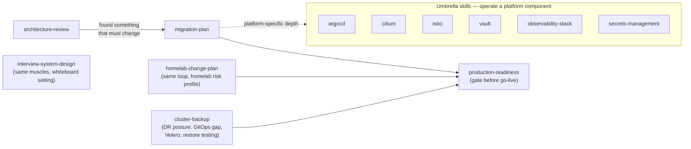
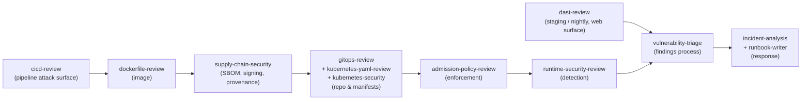
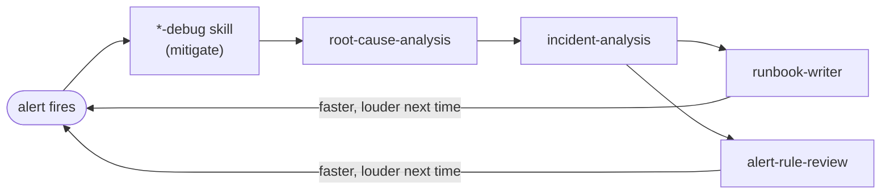

# Skill Map

## Quick task index

Start with the symptom or task. Each link opens the skill directly. The last column names a
nearby task with a different entry point.

| Symptom or task | Open | Use another skill when… |
|---|---|---|
| PVC Pending, attach error, or volume expansion stuck | [`storage-debug`](../skills/storage-debug/SKILL.md) | A pod fails for a reason outside storage → `kubernetes-debug`. |
| Certificate not Ready or ACME challenge stuck | [`cert-manager-debug`](../skills/cert-manager-debug/SKILL.md) | You are designing the traffic entry point → `ingress`. |
| Argo CD Application OutOfSync or Degraded | [`argocd-debug`](../skills/argocd-debug/SKILL.md) | The controller installation or RBAC itself needs design → `argocd`. |
| Pod crashing, Pending, or service broken with no known subsystem | [`kubernetes-debug`](../skills/kubernetes-debug/SKILL.md) | A storage, CNI, mesh, or certificate signal is already known → its debugger above or below. |
| Cilium drop or network policy denial | [`cilium-debug`](../skills/cilium-debug/SKILL.md) | You are designing or upgrading Cilium → `cilium`. |
| Istio 503, mTLS, or route failure | [`istio-debug`](../skills/istio-debug/SKILL.md) | You are choosing or operating the mesh → `istio`. |
| Upgrade a Kubernetes cluster | [`upgrade-readiness`](../skills/upgrade-readiness/SKILL.md) | The change is a general service migration → `migration-plan`. |
| Plan cluster backup and restore | [`cluster-backup`](../skills/cluster-backup/SKILL.md) | You are debugging a single volume now → `storage-debug`. |
| Review Kubernetes YAML before apply | [`kubernetes-yaml-review`](../skills/kubernetes-yaml-review/SKILL.md) | The artifact is a Helm chart → `helm-review`. |
| Review a Helm chart or chart upgrade | [`helm-review`](../skills/helm-review/SKILL.md) | You only have rendered manifests → `kubernetes-yaml-review`. |
| Audit cluster or workload security posture | [`kubernetes-security`](../skills/kubernetes-security/SKILL.md) | You are authoring an admission rule → `admission-policy-review`. |
| Get Kubernetes network security recommendations with Cilium or propose Cilium NetworkPolicy | [`cilium`](../skills/cilium/SKILL.md) | You need a broad workload/RBAC security audit → `kubernetes-security`; existing Cilium policy is dropping traffic → `cilium-debug`. |
| Write or review a Kyverno, Gatekeeper, or PSA rule | [`admission-policy-review`](../skills/admission-policy-review/SKILL.md) | You are investigating runtime alerts → `runtime-security-review`. |
| Review runtime detection rules or alerts | [`runtime-security-review`](../skills/runtime-security-review/SKILL.md) | You need preventive admission rules → `admission-policy-review`. |
| Design ingress or migrate to Gateway API | [`ingress`](../skills/ingress/SKILL.md) | Only the TLS certificate is failing → `cert-manager-debug`. |
| Design or operate Cilium | [`cilium`](../skills/cilium/SKILL.md) | A live Cilium drop needs diagnosis → `cilium-debug`. |
| Design or operate Istio | [`istio`](../skills/istio/SKILL.md) | A live route or mTLS failure needs diagnosis → `istio-debug`. |
| Design or diagnose workload or node autoscaling | [`kubernetes-autoscaling`](../skills/kubernetes-autoscaling/SKILL.md) | A pod is failing for a reason unrelated to scaling → `kubernetes-debug`. |
| Install or operate Argo CD | [`argocd`](../skills/argocd/SKILL.md) | One Application is stuck → `argocd-debug`. |
| Design an ApplicationSet generator | [`argocd-applicationset`](../skills/argocd-applicationset/SKILL.md) | You are reviewing the overall GitOps repository flow → `gitops-review`. |
| Review GitOps repository structure or promotion | [`gitops-review`](../skills/gitops-review/SKILL.md) | The issue is Argo CD controller operation → `argocd`. |
| Design Kubernetes secret delivery | [`secrets-management`](../skills/secrets-management/SKILL.md) | You are operating Vault itself → `vault`. |
| Deploy or operate Vault/OpenBao | [`vault`](../skills/vault/SKILL.md) | You are choosing how Kubernetes receives secrets → `secrets-management`. |
| Review Terraform or OpenTofu code or plan | [`terraform-review`](../skills/terraform-review/SKILL.md) | The task is a broader architecture review → `architecture-review`. |
| Plan a Proxmox or homelab change | [`homelab-change-plan`](../skills/homelab-change-plan/SKILL.md) | You need a general migration cutover → `migration-plan`. |
| Plan a service or infrastructure migration | [`migration-plan`](../skills/migration-plan/SKILL.md) | You are checking an already designed release → `production-readiness`. |
| Review repository or system architecture | [`architecture-review`](../skills/architecture-review/SKILL.md) | You have a concrete deployment artifact → its artifact review skill. |
| Check production readiness | [`production-readiness`](../skills/production-readiness/SKILL.md) | You are reviewing a single chart or manifest → `helm-review` or `kubernetes-yaml-review`. |
| Review a CI/CD pipeline | [`cicd-review`](../skills/cicd-review/SKILL.md) | The focus is image provenance after build → `supply-chain-security`. |
| Review image signing, SBOMs, or provenance | [`supply-chain-security`](../skills/supply-chain-security/SKILL.md) | The focus is the Dockerfile → `dockerfile-review`. |
| Review a Dockerfile | [`dockerfile-review`](../skills/dockerfile-review/SKILL.md) | The concern is pipeline permissions → `cicd-review`. |
| Review a vulnerability finding | [`vulnerability-triage`](../skills/vulnerability-triage/SKILL.md) | The concern is a runtime detection rule → `runtime-security-review`. |
| Review or set up a DAST scan | [`dast-review`](../skills/dast-review/SKILL.md) | The concern is CI permissions or triggers → `cicd-review`. |
| Design or operate Prometheus and telemetry storage | [`observability-stack`](../skills/observability-stack/SKILL.md) | You are judging service signals and SLOs → `observability-review`. |
| Review service observability or SLOs | [`observability-review`](../skills/observability-review/SKILL.md) | You are changing a specific alert expression → `alert-rule-review`. |
| Review a Prometheus alert rule | [`alert-rule-review`](../skills/alert-rule-review/SKILL.md) | You are designing a dashboard → `grafana-dashboards`. |
| Build or review a Grafana dashboard | [`grafana-dashboards`](../skills/grafana-dashboards/SKILL.md) | You are deciding which signals matter → `observability-review`. |
| Fix a Go bug | [`go-bugfix`](../skills/go-bugfix/SKILL.md) | You are reviewing code without editing it → `go-code-review`. |
| Review Go code | [`go-code-review`](../skills/go-code-review/SKILL.md) | The review is specifically about tests → `go-testing-review`. |
| Review or improve Go tests | [`go-testing-review`](../skills/go-testing-review/SKILL.md) | You are fixing a confirmed production bug → `go-bugfix`. |
| Review a PR with no narrower artifact skill | [`pr-review`](../skills/pr-review/SKILL.md) | Go, Helm, Kubernetes YAML, Dockerfile, or another artifact has its own review skill. |
| Investigate an unclear failure's cause | [`root-cause-analysis`](../skills/root-cause-analysis/SKILL.md) | A known Kubernetes subsystem has a specific debugger. |
| Analyze an incident or write a postmortem | [`incident-analysis`](../skills/incident-analysis/SKILL.md) | The cause is still unknown → `root-cause-analysis`. |
| Write an operational runbook | [`runbook-writer`](../skills/runbook-writer/SKILL.md) | You are writing the incident account → `incident-analysis`. |
| Write a commit message | [`git-message`](../skills/git-message/SKILL.md) | You are reviewing the change itself → `pr-review`. |
| Improve a short English technical message | [`english-technical-message`](../skills/english-technical-message/SKILL.md) | You need an operational runbook → `runbook-writer`. |
| Practice a system design interview answer | [`interview-system-design`](../skills/interview-system-design/SKILL.md) | You are reviewing a real repository architecture → `architecture-review`. |

The README table lists every skill flat; this is the top-down view — which skill to enter
through for a given situation, how skills pair and hand off to each other, and what reference
depth each one carries. Diagrams are Mermaid (GitHub renders them inline).

## 1. Entry point — pick by situation

Five kinds of work, five lanes. Everything in the repo hangs off one of these.

### Debug lane (live cluster, read-only first)

`kubernetes-debug` is the generic hub; hand off sideways as soon as the signal names a
subsystem. After mitigation the lane continues into investigation and writeup.

### Review lane (static artifact, before merge/apply)

Route by artifact type; `pr-review` is the generic entry when nothing more specific fits.

| Artifact on the table | Skill | Escalates to |
|---|---|---|
| any diff / PR | `pr-review` | language- or domain-specific below |
| Go code | `go-code-review` | `go-testing-review` (tests), `go-bugfix` (fix workflow) |
| Kubernetes manifests | `kubernetes-yaml-review` | `kubernetes-security` (security-specific audit) |
| Helm chart | `helm-review` | `kubernetes-yaml-review` for the rendered output |
| Dockerfile | `dockerfile-review` | `supply-chain-security` (what happens after build) |
| CI/CD pipeline | `cicd-review` | `supply-chain-security`, `dast-review` |
| Terraform / OpenTofu | `terraform-review` | (knowledge base: upstream `terraform-skill`) |
| GitOps repo layout | `gitops-review` | `argocd-applicationset` (generator design) |
| Ingress / Gateway API config | `ingress` | `cert-manager-debug` (listener TLS), `cilium`/`istio` (their gateway impls) |
| Prometheus alert rules | `alert-rule-review` | `runbook-writer` (the rule's runbook link) |
| Grafana dashboards | `grafana-dashboards` | `observability-review` (are these the right signals) |
| Kyverno/Gatekeeper policy | `admission-policy-review` | `kubernetes-security` |
| HPA/KEDA/Karpenter config | `kubernetes-autoscaling` | `production-readiness` (PDBs, graceful shutdown) |
| Cluster upgrade plan | `upgrade-readiness` | `cluster-backup` (backup gate), `migration-plan` (methodology) |
| commit message | `git-message` | — |

### Design lane (plan first, never mutate)

Methodology skills frame the work; umbrella skills carry the platform-specific depth.

### DevSecOps chain (security lane)

The delivery chain is covered by composition — each stage has exactly one owner, findings all
drain into `vulnerability-triage`:

### Communication lane

`git-message` (commits), `english-technical-message` (PR comments, Slack, recruiter replies),
`runbook-writer` and `incident-analysis` (their outputs are documents — they live in the debug
lane but end here).

## 2. Domain clusters — how skills within one domain divide the work

Repeating pattern: an **umbrella** (design/deploy/operate, multi-reference), a **debugger**
(symptom → cause, live and read-only), and **review** skills (static, pre-apply). Same
domain, different triggers — they cross-reference instead of overlapping.

```mermaid
flowchart TD
    subgraph K8S["Kubernetes core"]
        KYR["kubernetes-yaml-review<br/>(static, pre-apply)"] ~~~ KSEC["kubernetes-security<br/>(security audit)"] ~~~ KDBG["kubernetes-debug<br/>(live diagnosis)"]
        HR["helm-review<br/>(charts)"]
    end
    subgraph GITOPS["GitOps / Argo CD"]
        ARGO2["argocd<br/>(umbrella: install/HA/RBAC/DR)"] --- ADBG["argocd-debug<br/>(one stuck Application)"]
        ARGO2 --- ASET["argocd-applicationset<br/>(generator design)"]
        ARGO2 --- GREV["gitops-review<br/>(repo structure, promotion)"]
    end
    subgraph NET["Networking / mesh / TLS"]
        CIL2["cilium<br/>(umbrella)"] --- CDBG2["cilium-debug"]
        IST2["istio<br/>(umbrella)"] --- IDBG2["istio-debug"]
        ING["ingress<br/>(umbrella: north-south,<br/>Gateway API migration)"] --- CMDBG["cert-manager-debug<br/>(listener TLS troubleshooting)"]
    end
    subgraph OBSD["Observability"]
        OSTACK["observability-stack<br/>(umbrella: operate the stack)"] --- OREV["observability-review<br/>(what to instrument, SLOs)"]
        OREV --- ALR["alert-rule-review"] 
        OREV --- GD["grafana-dashboards"]
    end
    subgraph SECR["Secrets"]
        VLT2["vault<br/>(umbrella: HA/unseal/engines)"] --- SM2["secrets-management<br/>(ESO: delivery into k8s)"]
    end
```

## 3. Cross-cutting loops

**The incident loop** — the reason debug, investigation, writeup, runbook, and alert skills all
exist in one repo; each pass around the loop makes the next one shorter:

**The change loop** — design → review → gate → (if it breaks) debug:
`architecture-review`/`migration-plan` → artifact-specific review skills →
`production-readiness` → deploy (GitOps) → debug lane if needed.

## 4. Full inventory — depth and references

**Deep** = SKILL.md + `references/` (exact facts an agent can't reliably hold: symptom tables,
error-text taxonomies, version floors). **Flat** = SKILL.md only (the workflow *is* the
content). `conditional/` references load only when their platform signal is detected.

| Skill | Depth | References |
|---|---|---|
| `admission-policy-review` | deep | kyverno-deployment, kyverno-patterns |
| `alert-rule-review` | deep | promql-patterns |
| `architecture-review` | flat | — |
| `argocd` | deep | install-ha, operations, rbac-sso, repositories, sync-design |
| `argocd-applicationset` | deep | generators |
| `argocd-debug` | deep | playbooks |
| `cert-manager-debug` | deep | playbooks |
| `cicd-review` | deep | terraform-pipelines |
| `cilium` | deep | install, network-policies, hubble, encryption, clustermesh, gateway-egress + conditional/{eks,gke,aks} |
| `cilium-debug` | deep | playbooks |
| `cluster-backup` | deep | velero |
| `dast-review` | deep | zap-usage |
| `dockerfile-review` | deep | examples |
| `english-technical-message` | flat | — |
| `git-message` | flat | — |
| `gitops-review` | deep | tools, validation-policy |
| `go-bugfix` | flat | — (Go knowledge base lives upstream in `golang-*`) |
| `go-code-review` | flat | — (same) |
| `go-testing-review` | flat | — (same) |
| `grafana-dashboards` | deep | panel-patterns |
| `helm-review` | deep | patterns, tools |
| `homelab-change-plan` | flat | — |
| `incident-analysis` | flat | — |
| `ingress` | deep | ingress-nginx, gateway-api, migration |
| `interview-system-design` | flat | — |
| `istio` | deep | install-upgrade, sidecar-vs-ambient, traffic-management, security, telemetry |
| `istio-debug` | deep | playbooks |
| `kubernetes-autoscaling` | deep | workload-autoscaling, node-autoscaling |
| `kubernetes-debug` | deep | playbooks + conditional/managed-clusters |
| `kubernetes-security` | deep | examples, hardening, tools |
| `kubernetes-yaml-review` | deep | examples, reliability, tools, workload-patterns |
| `migration-plan` | flat | — |
| `observability-review` | deep | instrumentation, prometheus-stack |
| `observability-stack` | deep | prometheus-ha-scaling, long-term-storage, otel-collector, logs-traces |
| `production-readiness` | deep | checklists |
| `pr-review` | flat | — |
| `root-cause-analysis` | flat | — |
| `runbook-writer` | flat | — |
| `runtime-security-review` | deep | falco-deployment, tetragon-deployment |
| `secrets-management` | deep | eso-deployment |
| `storage-debug` | deep | playbooks |
| `supply-chain-security` | deep | signing-attestation |
| `terraform-review` | deep | examples, module-design, security-compliance, state-operations, tools, version-guards |
| `upgrade-readiness` | deep | upgrade-checks |
| `vault` | deep | deploy-ha, auth-policies, secret-engines, kubernetes-and-dr |
| `vulnerability-triage` | flat | — |

46 skills: 32 deep, 14 flat.

## Maintenance

When adding a skill, place it on this map at the same time as the README table row: which lane
is its entry point, does it pair with an umbrella/debugger, does it join a chain, and what depth
does it get (justify against the depth policy in `design-notes.md`).
